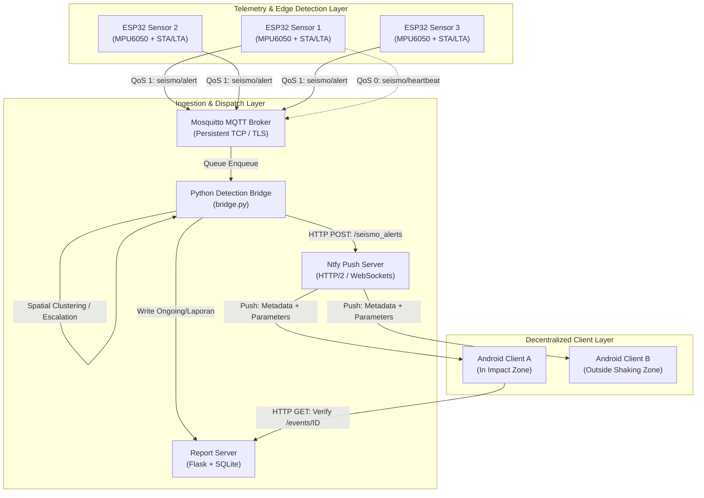
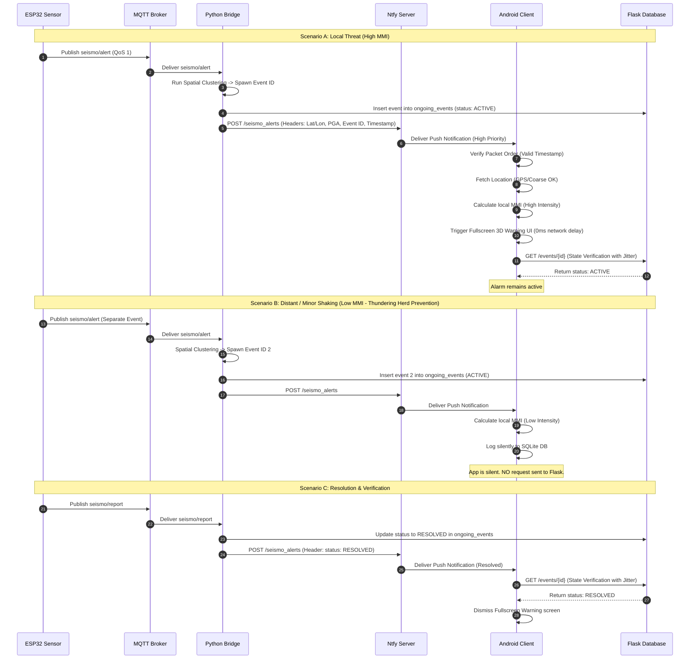

# System Architecture & Technical Specification: QuakeAlert Real-Time EEW

This document outlines the architectural blueprint, telemetry pipeline, and protocol specification for the next-generation **QuakeAlert Earthquake Early Warning (EEW)** system. The design emphasizes sub-second latency, network-resilient telemetry, decentralized client-side impact calculation, and robust spatial event aggregation utilizing the **Hybrid Smart Push** pattern.

---

## 1. System Topology & Data Flow

The system consists of three primary layers: **Telemetry & Edge Detection** (ESP32), **State Management & Aggregation** (Mosquitto + Python Bridge + Flask DB), and the **Decentralized Mobile Clients** (Android Thin Client).



---

## 2. Telemetry Pipeline Specification (ESP32 → MQTT Broker)

### 2.1 Time Synchronization & Communication Protocol
To ensure the system works globally across different regions and time zones, **all components are standardized on UTC (Coordinated Universal Time)**. 
- **Internal Logic & Timing:** Uses Unix Epoch timestamps (seconds elapsed since `1970-01-01T00:00:00Z`).
- **Network Payloads:** Formatted as ISO 8601 UTC strings (e.g. `2026-06-29T07:18:10Z`).

Each ESP32 community station is equipped with an MPU6050 accelerometer sampling at **100 Hz**. The firmware computes a real-time **STA/LTA (Short-Term Average to Long-Term Average)** ratio of acceleration.
- **Short-Term Window (STA):** 1.0 second (captures immediate seismic waves).
- **Long-Term Window (LTA):** 10.0 seconds (represents background environmental noise).
- **Trigger Threshold:** When $\text{STA}/\text{LTA} \ge 2.5$, the device declares a seismic trigger.

The ESP32 communicates with the central MQTT Broker via five dedicated topics:

| Topic | QoS | Payload Format | Frequency / Trigger Conditions |
| :--- | :---: | :--- | :--- |
| `seismo/heartbeat` | 0 | JSON containing metadata and stats | Every 60 seconds (constant rate) |
| `seismo/status` | 1 | JSON with online/offline state | Published as Last Will & Testament (LWT) |
| `seismo/alert` | 1 | JSON containing trigger parameters | Immediate. Transmitted when STA/LTA threshold exceeded |
| `seismo/report` | 1 | JSON containing complete event summary | Transmitted when local shaking ends ($\text{STA}/\text{LTA} < 1.1$) |
| `seismo/command` | 1 | JSON command directives | On-demand instructions sent to sensors |

### 2.2 Telemetry Payloads

#### `seismo/heartbeat` (QoS 0)
Sent regularly to confirm sensor health and report baseline noise.
```json
{
  "id": "ESP32_WestJava_01",
  "version": "2.1.0",
  "lat": -6.9175,
  "lon": 107.6191,
  "lokasi": "Bandung, Jawa Barat",
  "pga": 0.002,
  "rssi": -65,
  "uptime": 172800
}
```

#### `seismo/alert` (QoS 1)
Dispatched instantly the moment the sensor detects anomalous vibration.
```json
{
  "id": "ESP32_WestJava_01",
  "waktu": "2026-06-29T07:18:10Z",
  "lat": -6.9175,
  "lon": 107.6191,
  "lokasi": "Bandung, Jawa Barat",
  "pga": 0.358,
  "intensitas": "VI (Kuat)"
}
```

#### `seismo/report` (QoS 1)
Dispatched when local vibrations fall back to baseline levels, summarizing the earthquake impact at the sensor node.
```json
{
  "id": "ESP32_WestJava_01",
  "waktu_mulai": "2026-06-29T07:18:10Z",
  "waktu_selesai": "2026-06-29T07:18:48Z",
  "pga_max": 0.485,
  "intensitas_max": "VI (Kuat)",
  "total_triggers": 12,
  "lat": -6.9175,
  "lon": 107.6191
}
```

---

## 3. Real-Time Alert Engine & State Database (Server-Side)

The core ingestion engine (`bridge.py`) sits on top of a thread-safe message queue to ingest telemetry from the MQTT broker asynchronously. It runs a stateful event engine using an in-memory database of active earthquakes and synchronizes active event statuses to a database table.

### 3.1 SQLite Schema & Concurrency Settings (`laporan_gempa.db`)
To support real-time state resolution from clients, the SQLite database is expanded with an `ongoing_events` table. 

To prevent concurrency database locks (`SQLITE_BUSY`) when thousands of clients are reading the state while sensors are writing reports, **Write-Ahead Logging (WAL)** mode and a connection busy timeout must be enabled on every SQLite database connection initialization.

```sql
CREATE TABLE IF NOT EXISTS ongoing_events (
    event_id TEXT PRIMARY KEY,
    status TEXT NOT NULL,          -- 'ACTIVE' or 'RESOLVED'
    epicenter_lat REAL NOT NULL,
    epicenter_lon REAL NOT NULL,
    max_pga REAL NOT NULL,
    started_at TEXT NOT NULL,      -- ISO 8601 UTC String
    updated_at TEXT NOT NULL       -- ISO 8601 UTC String
);
```

#### Database Connection Initialization Code (Python / Flask)
```python
def get_db_connection(db_file_path):
    conn = sqlite3.connect(db_file_path, timeout=5.0) # 5000ms busy timeout
    conn.row_factory = sqlite3.Row
    # Enable WAL mode for concurrent read/write support
    conn.execute("PRAGMA journal_mode=WAL;")
    conn.execute("PRAGMA synchronous=NORMAL;")
    return conn
```

### 3.2 Spatio-Temporal Clustering Engine (State Machine)
To track distinct earthquakes concurrently and prevent overlapping duplicate events (e.g. when sensors situated 50-100 km apart trigger within seconds of each other), the clustering engine uses a **Spatio-Temporal Clustering** rule:

```python
ongoing_events = {
    "EVENT_20260629_A8D9": {
        "event_id": "EVENT_20260629_A8D9",
        "epicenter_lat": -6.9175,
        "epicenter_lon": 107.6191,
        "max_pga": 0.358,
        "tier": 1,
        "sensors": {
            "ESP32_WestJava_01": {
                "lat": -6.9175,
                "lon": 107.6191,
                "pga": 0.358,
                "triggered_at": 178271810  # Unix Epoch UTC Timestamp
            }
        },
        "created_at": 178271810,            # Unix Epoch UTC Timestamp
        "updated_at": 178271810             # Unix Epoch UTC Timestamp
    }
}
```

#### Event Ingestion & Spatio-Temporal Clustering Logic
Upon receiving a payload on `seismo/alert` from `sensor_x` at time $t_{now}$ (expressed in Unix Epoch UTC seconds):
1. **Distance & Time Calculations:** For each active event in `ongoing_events`, calculate:
   - The Haversine distance $d$ between the sensor coordinates and the event epicenter.
   - The elapsed time $\Delta t = t_{now} - \text{event.created\_at}$ (in seconds).
2. **Spatio-Temporal Cluster Match:** The incoming trigger is grouped into an existing event if it satisfies either of the following conditions:
   - **Condition A (Base Proximity):** The distance $d \le 50\text{ km}$.
   - **Condition B (Wave Propagation Expansion):** The distance $d \le 100\text{ km}$ AND the elapsed time $\Delta t \le 15\text{ seconds}$ (accounts for P-wave seismic propagation across neighboring regional sensors).
3. **Cluster Action:**
   - If a match is found, add the sensor to the event's sensor list.
   - The event's `max_pga` is updated to $\max(\text{event.max\_pga}, \text{sensor.pga})$.
   - If the event is in **Tier 1** and the current time is within 30 seconds of `created_at`, the event escalates to **Tier 2 (Confirmed Event)**.
   - Update the corresponding row in the SQLite `ongoing_events` table.
4. **Independent Spawn:**
   - If the trigger does not match any existing event under the spatio-temporal rule (or is $\ge 500$ km away), it is treated as a separate earthquake. A new `Event ID` is spawned.
   - The event is initialized as **Tier 1 (Sentinel Mode)**, with the epicenter coordinate anchored directly to this first responding sensor.
   - Insert a new row into the `ongoing_events` table in `laporan_gempa.db`.

### 3.3 Event Resolution and Fail-Safes
To prevent the client app from staying locked in a warning state if a sensor fails or is destroyed:
1. **Active Resolution:** When a sensor stops shaking, it publishes `seismo/report`. Once all mapped sensors publish their report (or the timer expires), the server marks the event row in `ongoing_events` as `RESOLVED`, copies the finalized log to the `laporan` table, and broadcasts a resolution push.
2. **Deadman's Switch:** A background monitoring thread evaluates `ongoing_events` every 5 seconds. If an active event is not updated or resolved within **60 seconds**, the server forcefully updates the event status to `RESOLVED` in the SQLite database, cleanses the in-memory cache, and transmits a clear command to the clients.

---

## 4. Ingestion & Push Dispatch Layer (Ntfy Integration)

The Bridge Server communicates with the Ntfy service to publish system events. Ntfy broadcasts these payload messages to Android clients via HTTP/2 or WebSocket connections.

### 4.1 Hybrid Smart Push Headers
Alert messages are sent as high-priority push payloads containing geo-coordinates and telemetry in the metadata headers. This allows the client to calculate impacts **instantly** without waiting to query the API.

- **Endpoint:** `POST https://ntfy.quakealert.web.id/seismo_alerts`
- **Headers:**
  - `Title`: `EARTHQUAKE WARNING STRONG (INTENSITY VI)`
  - `Priority`: `5` (Triggers urgent priority alerts bypass Android Doze Mode)
  - `Tags`: `warning,earthquake,geo:lat;lon` (Metadata tags parsed by client)
  - `X-Event-ID`: `EVENT_20260629_A8D9`
  - `X-Epicenter-Lat`: `-6.9175`
  - `X-Epicenter-Lon`: `107.6191`
  - `X-Max-PGA`: `0.485`
  - `X-Event-Tier`: `2`
  - `X-Status`: `ACTIVE`
  - `X-Server-Timestamp`: `178271810` (Unix Epoch UTC seconds, used to ignore stale/out-of-order packets timezone-agnostically)

---

## 5. Flask REST API State Endpoints

To support state verification and prevent out-of-sync alarms, the Flask database server (`server.py`) exposes state endpoints for the Android client.

### 5.1 GET `/events/<event_id>`
Fetches the current real-time state of a specific earthquake event.

- **URL:** `/events/<event_id>`
- **Method:** `GET`
- **Success Response (200 OK):**
```json
{
  "event_id": "EVENT_20260629_A8D9",
  "status": "ACTIVE",
  "epicenter_lat": -6.9175,
  "epicenter_lon": 107.6191,
  "max_pga": 0.485,
  "started_at": "2026-06-29T07:18:10Z",
  "updated_at": "2026-06-29T07:18:35Z",
  "timestamp": 178271835
}
```

### 5.2 GET `/events`
Fetches a list of all active earthquakes.
- **URL:** `/events?status=active`
- **Method:** `GET`
- **Success Response (200 OK):**
```json
[
  {
    "event_id": "EVENT_20260629_A8D9",
    "status": "ACTIVE",
    "epicenter_lat": -6.9175,
    "epicenter_lon": 107.6191,
    "max_pga": 0.485,
    "started_at": "2026-06-29T07:18:10Z",
    "updated_at": "2026-06-29T07:18:35Z",
    "timestamp": 178271835
  }
]
```

---

## 6. Android Thin-Client Architecture & Hybrid Flow

The mobile application acts as a "Thin Client" to protect user privacy. It performs local calculations using local coordinates and is structured using Clean Architecture and MVVM patterns.

```
                  [ Ntfy Broadcast Received / WebSocket ]
                                     │
                          Extract Event Metadata:
                   Epicenter, PGA, Tier, Server Timestamp
                                     │
                        Is Timestamp Out of Order?
                         (Older than cached state?)
                                     ├─── YES ───► [ Discard Packet ]
                                     │ (No Action)
                                     ▼ NO
                        Resolve Device Location
                   (GPS -> Fallback to Coarse Cell ID)
                                     │
                         Is Location Available?
                                     ├─── NO ────► [ Silent Suppress ]
                                     │ (Prevent False Alarms)
                                     ▼ YES
                        Calculate Haversine Distance
                        Between Device & Epicenter
                                     │
                       Compute Attenuated PGA & MMI
                       (Logarithmic Attenuation Model)
                                     │
                                     ▼
                   Is Estimated MMI >= User Threshold?
                                     │
                  ┌──────────────────┴──────────────────┐
                 YES                                    NO
                  │                                     │
        ┌─────────▼─────────┐                 ┌─────────▼─────────┐
        │  Trigger Alarm!   │                 │  Log Event        │
        │  - 3D Warning UI  │                 │  Silently         │
        │  - Play Alarm     │                 │  - NO API fetch   │
        │  - Vibrate        │                 │  - Saves server   │
        └─────────┬─────────┘                 │    from overload  │
                  │                           └───────────────────┘
         Query Flask API (Async)
      `/events/{event_id}` to verify
       (With Jittered Retry 0-3s)
                  │
        ┌─────────▼─────────┐
      Status == ACTIVE?
        ┌─────────┴─────────┐
       YES                  NO
        │                    │
  [ Keep Alarm ]     [ Silence Alarm ]
                     (Restore State)
```

### 6.1 Telemetry Receiver Service
A background foreground service (`SeismicAlertReceiverService.kt`) runs continuously. It uses a low-overhead connection to the Ntfy server to handle push alerts even when the app is closed.

### 6.2 Client-Side Processing Pipeline
When a push warning arrives, the service executes the following logic:

#### Step 1: Timestamp Verification (Prevent Out-of-Order Packets)
The app maintains a local cache of the most recent `updated_at` server timestamp for each active `Event ID`.
- If `X-Server-Timestamp` from the incoming push notification is older than the locally cached timestamp for that Event ID, the packet is immediately discarded.

#### Step 2: Location Retrieval (Coarse Fallback & Failure Handling)
To compute the distance to the epicenter:
1. The app queries `FusedLocationProviderClient` for GPS location.
2. If GPS is disabled or unavailable, the app falls back to **Coarse Location** (cellular network / Wi-Fi towers).
3. If location is completely unavailable or permissions are disabled, the app **suppresses the alarm (does not sound)** to prevent false warnings. The event is written silently to the local log database.

#### Step 3: Epicenter Distance Calculation
Using the resolved location $(lat_{device}, lon_{device})$, the app calculates the distance ($d$, in km) to the epicenter using the Haversine formula:

$$\Delta\phi = \phi_2 - \phi_1, \quad \Delta\lambda = \lambda_2 - \lambda_1$$
$$a = \sin^2\left(\frac{\Delta\phi}{2}\right) + \cos(\phi_1)\cos(\phi_2)\sin^2\left(\frac{\Delta\lambda}{2}\right)$$
$$c = 2 \cdot \arctan2\left(\sqrt{a}, \sqrt{1-a}\right)$$
$$d = R \cdot c \quad (\text{where } R = 6371\text{ km})$$

#### Step 4: Logarithmic Attenuation Model
The application estimates the local Peak Ground Acceleration ($\text{PGA}_{\text{local}}$) at the user's coordinates using an attenuation equation:

$$\log_{10}(\text{PGA}_{\text{local}}) = \log_{10}(\text{PGA}_{\text{epicenter}}) - \alpha \cdot \log_{10}(d) - \beta \cdot d$$

Where:
- $\text{PGA}_{\text{epicenter}}$ is the maximum PGA reported by the server.
- $d$ is the calculated distance in kilometers.
- $\alpha = 1.2$ (Geometric spreading coefficient).
- $\beta = 0.0025$ (Material absorption coefficient).

#### Step 5: Intensity Conversion (MMI Scale)
The local PGA is converted to the Modified Mercalli Intensity (MMI) scale:

$$\text{MMI}_{\text{local}} = 3.66 \cdot \log_{10}(\text{PGA}_{\text{local}}) - 1.66$$

If $\text{MMI}_{\text{local}} < 1.0$, it is rounded to $1.0$.

#### Step 6: Smart Filtering Threshold & Jittered Async Sync
The app compares the computed $\text{MMI}_{\text{local}}$ against the user's alert settings.

```kotlin
val estimatedMmi = calculateLocalMmi(epicenterLat, epicenterLon, maxPga)
val userThreshold = sharedPreferences.getFloat("alert_threshold_mmi", 3.0f) // Default to MMI III

if (estimatedMmi >= userThreshold) {
    // 1. Escalate IMMEDIATELY to warning screen (0ms network overhead)
    context.startActivity(WarningActivity.newIntent(context, eventId, estimatedMmi))
    
    // 2. Perform background State Sync to verify the active state
    // Incorporates a random jitter (0 to 3000 ms) to avoid thundering herd on API
    viewModelScope.launch {
        val jitterMs = (0..3000).random().toLong()
        delay(jitterMs)
        try {
            val state = eventRepository.fetchEventState(eventId)
            if (state.status == "RESOLVED" || state.status == "DISABLED") {
                // Silently dismiss alarm if the server confirms it is resolved
                warningManager.dismissWarning(eventId)
            }
        } catch (e: Exception) {
            // API Fail-Tolerance: If API fails, trust the push data and keep warning active.
            // Do NOT silence the warning on server errors.
        }
    }
} else {
    // Silently cache in local Room Database (laporan_gempa)
    // DO NOT query the server API to prevent thundering herd load
    quakeDao.insert(QuakeEntity(eventId, epicenterLat, epicenterLon, estimatedMmi, isWarningTriggered = false))
}
```

---

## 7. Sequence Flow: Detection, Escalation & Resolution


